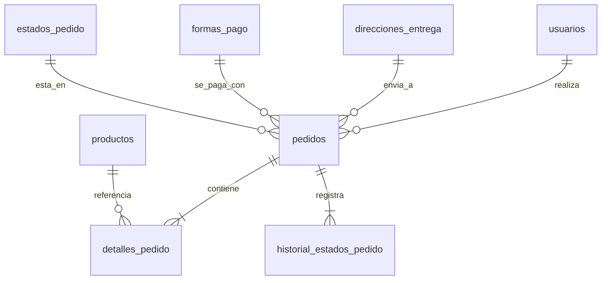

# Diseño Técnico: Backend Pedidos y FSM (Change 023)

Este documento describe la arquitectura detallada, el modelado de base de datos relacional y el flujo transaccional para la implementación de pedidos y su máquina de estados finita.

---

## 1. Diseño de la Base de Datos (SQLite)

Mapearemos tres nuevas clases heredando de `SQLModel` en `backend/app/modules/pedidos/models.py`.



### Tabla `pedidos`
Mapea la entidad principal del pedido de comida.
- `id`: `Optional[int] = Field(primary_key=True)`
- `usuario_id`: `int = Field(foreign_key="usuarios.id")`
- `direccion_id`: `Optional[int] = Field(foreign_key="direcciones_entrega.id", nullable=True)` (puede ser null si es retiro por local)
- `estado_codigo`: `str = Field(foreign_key="estados_pedido.codigo", default="PENDIENTE")`
- `forma_pago_codigo`: `str = Field(foreign_key="formas_pago.codigo")`
- `subtotal`: `Decimal = Field(decimal_places=2, max_digits=10)`
- `descuento`: `Decimal = Field(decimal_places=2, max_digits=10, default=0.00)`
- `costo_envio`: `Decimal = Field(decimal_places=2, max_digits=10, default=50.00)`
- `total`: `Decimal = Field(decimal_places=2, max_digits=10)`
- `notas`: `Optional[str] = Field(default=None)`
- `created_at`: `datetime = Field(default_factory=datetime.utcnow)`
- `updated_at`: `datetime = Field(default_factory=datetime.utcnow)`
- `deleted_at`: `Optional[datetime] = Field(default=None)`

### Tabla `detalles_pedido`
Mapea los productos individuales añadidos al pedido, registrando snapshots históricos.
- `id`: `Optional[int] = Field(primary_key=True)`
- `pedido_id`: `int = Field(foreign_key="pedidos.id")`
- `producto_id`: `int = Field(foreign_key="productos.id")`
- `cantidad`: `int = Field(nullable=False)`
- `nombre_snapshot`: `str = Field(max_length=150)` (nombre al momento de compra)
- `precio_snapshot`: `Decimal = Field(decimal_places=2, max_digits=10)` (precio al momento de compra)
- `subtotal_snap`: `Decimal = Field(decimal_places=2, max_digits=10)`
- `personalizacion`: `Optional[str] = Field(default=None)` (guardado como string de IDs de ingredientes removidos o JSON)

### Tabla `historial_estados_pedido`
Auditoría cronológica estricta del avance del pedido en la FSM.
- `id`: `Optional[int] = Field(primary_key=True)`
- `pedido_id`: `int = Field(foreign_key="pedidos.id")`
- `estado_desde`: `Optional[str] = Field(foreign_key="estados_pedido.codigo", nullable=True)`
- `estado_hacia`: `str = Field(foreign_key="estados_pedido.codigo")`
- `usuario_id`: `int = Field(foreign_key="usuarios.id")` (ID del usuario que accionó el cambio)
- `motivo`: `Optional[str] = Field(default=None)` (requerido al cancelar)
- `created_at`: `datetime = Field(default_factory=datetime.utcnow)`

---

## 2. Flujo Transaccional y Lógica FSM

La máquina de estados y las transacciones se orquestarán exclusivamente en `PedidoService` coordinando con el manager `PedidoUoW`.

### Pseudocódigo: Registro de Pedido (`crear`)
```python
def crear(usuario_id: int, data: CrearPedidoRequest) -> Pedido:
    with PedidoUoW(session) as uow:
        # 1. Validar forma de pago habilitada
        # 2. Iterar items y validar stock atómico
        subtotal = 0
        detalles_a_crear = []
        
        for item in data.items:
            producto = uow.productos.get_by_id(item.producto_id)
            if not producto or not producto.is_active:
                raise HTTPException(404, "Producto no disponible")
            if producto.stock_cantidad < item.cantidad:
                raise HTTPException(400, f"Stock insuficiente para {producto.nombre}")
                
            # Decrementar stock atómico
            producto.stock_cantidad -= item.cantidad
            uow.productos.add(producto)
            
            # Snapshots
            item_subtotal = producto.precio_base * item.cantidad
            subtotal += item_subtotal
            
            detalles_a_crear.append(DetallePedido(
                producto_id=producto.id,
                cantidad=item.cantidad,
                nombre_snapshot=producto.nombre,
                precio_snapshot=producto.precio_base,
                subtotal_snap=item_subtotal,
                personalizacion=item.personalizacion  # mapeo
            ))
            
        # 3. Calcular totales
        costo_envio = 50.00 if data.direccion_id else 0.00
        total = subtotal + costo_envio
        
        # 4. Crear pedido
        pedido = Pedido(
            usuario_id=usuario_id,
            direccion_id=data.direccion_id,
            estado_codigo="PENDIENTE",
            forma_pago_codigo=data.forma_pago_codigo,
            subtotal=subtotal,
            costo_envio=costo_envio,
            total=total,
            notas=data.notas
        )
        uow.pedidos.add(pedido)
        uow.flush()  # Para obtener el ID del pedido
        
        # 5. Crear detalles
        for det in detalles_a_crear:
            det.pedido_id = pedido.id
            uow.detalles.add(det)
            
        # 6. Registrar transición inicial FSM
        historial = HistorialEstadoPedido(
            pedido_id=pedido.id,
            estado_desde=None,
            estado_hacia="PENDIENTE",
            usuario_id=usuario_id,
            motivo="Pedido creado por el cliente"
        )
        uow.historial.add(historial)
        
    return pedido  # Commit automático en __exit__ si no hay excepciones
```

### Pseudocódigo: Avance de Estado (`avanzar_estado`)
```python
def avanzar_estado(pedido_id: int, usuario_id: int, roles: list, data: AvanzarEstadoRequest) -> Pedido:
    with PedidoUoW(session) as uow:
        pedido = uow.pedidos.get_by_id(pedido_id)
        if not pedido:
            raise HTTPException(404, "Pedido no encontrado")
            
        estado_actual = pedido.estado_codigo
        estado_siguiente = data.estado_hacia
        
        # 1. Validar FSM
        if estado_siguiente not in FSM[estado_actual]:
            raise HTTPException(400, f"Transición de {estado_actual} a {estado_siguiente} no permitida")
            
        # 2. Validar Roles
        is_admin = "ADMIN" in roles or "PEDIDOS" in roles
        if not is_admin:
            # Cliente solo puede cancelar
            if estado_siguiente != "CANCELADO":
                raise HTTPException(403, "No tienes permisos para realizar esta transición")
            if estado_actual not in ["PENDIENTE", "CONFIRMADO"]:
                raise HTTPException(403, "No puedes cancelar el pedido una vez en preparación")
            if pedido.usuario_id != usuario_id:
                raise HTTPException(403, "No puedes cancelar pedidos ajenos")
                
        # 3. Validar motivo si es cancelación
        if estado_siguiente == "CANCELADO" and not data.motivo:
            raise HTTPException(400, "El motivo de cancelación es obligatorio")
            
        # 4. Devolver stock si se cancela
        if estado_siguiente == "CANCELADO":
            for det in uow.detalles.get_by_pedido(pedido.id):
                prod = uow.productos.get_by_id(det.producto_id)
                prod.stock_cantidad += det.cantidad
                uow.productos.add(prod)
                
        # 5. Registrar
        pedido.estado_codigo = estado_siguiente
        pedido.updated_at = datetime.utcnow()
        uow.pedidos.add(pedido)
        
        historial = HistorialEstadoPedido(
            pedido_id=pedido.id,
            estado_desde=estado_actual,
            estado_hacia=estado_siguiente,
            usuario_id=usuario_id,
            motivo=data.motivo
        )
        uow.historial.add(historial)
        
    return pedido
```
