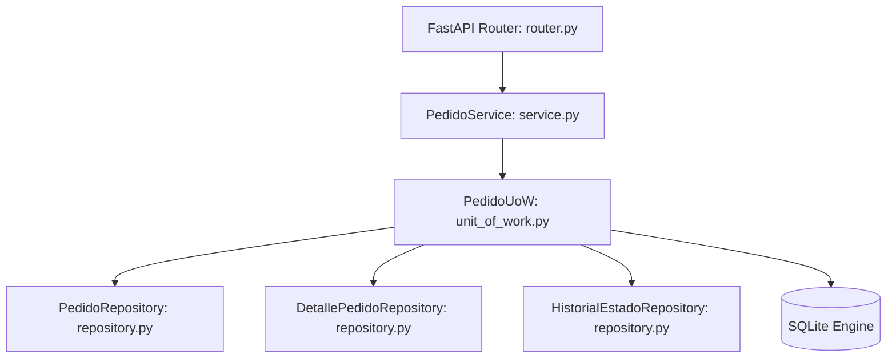

# Propuesta de Cambio: Implementación de Pedidos y Máquina de Estados (Change 023)

## 1. Contexto y Objetivos

Este cambio tiene como finalidad implementar el flujo transaccional central de **The Food Store** en el backend: la gestión de pedidos de comida (`Pedido` y `DetallePedido`) y el seguimiento histórico de sus estados a través de una **Máquina de Estados Finita (FSM)**.

### Objetivos Principales:
- Diseñar y mapear los modelos de persistencia para Pedidos, Detalles e Historial de transiciones en la base de datos relacional.
- Construir e implementar las reglas de la Máquina de Estados (FSM) para transicionar de forma segura.
- Garantizar la reducción atómica de stock de productos disponibles ante la confirmación/creación del pedido.
- Exponer una interfaz REST API limpia y segura con control de acceso basado en roles (CLIENT vs ADMIN/PEDIDOS).

---

## 2. Requerimientos y Reglas de Negocio (RN)

- **RN-01 (Mapa de FSM):** Las transiciones válidas de un pedido son:
  - `PENDIENTE` → `CONFIRMADO` o `CANCELADO`.
  - `CONFIRMADO` → `EN_PREP` o `CANCELADO`.
  - `EN_PREP` → `EN_CAMINO` o `CANCELADO`.
  - `EN_CAMINO` → `ENTREGADO`.
  - `ENTREGADO` y `CANCELADO` son estados terminales (sin salidas).
- **RN-02 (Transición Inicial):** Al crearse un pedido, se inicializa en `PENDIENTE` y se añade una entrada de historial con `estado_desde = NULL` y `estado_hacia = PENDIENTE`.
- **RN-03 (Permisos de Transición por Rol):**
  - El cliente (`CLIENT`) puede crear pedidos (`PENDIENTE`) y cancelarlos si aún están en estado `PENDIENTE` o `CONFIRMADO`.
  - El administrador o preparador (`ADMIN`/`PEDIDOS`) puede avanzar el pedido a cualquier estado válido en la FSM. No se permite que un cliente cancele un pedido una vez que este entra a cocina (`EN_PREP`).
- **RN-04 (Snapshots de Producto):** Dado que los precios y nombres de los productos pueden cambiar en el menú, al registrar los detalles de un pedido se capturarán *snapshots* (`nombre_snapshot` y `precio_snapshot`), asegurando que las facturas históricas no sufran modificaciones retroactivas.
- **RN-05 (Motivo de Cancelación):** Si el estado hacia el que se transiciona es `CANCELADO`, es obligatorio ingresar una justificación o `motivo` en la petición.
- **RN-06 (Reducción de Stock):** Al registrar un pedido, se debe decrementar la cantidad disponible del producto (`stock_cantidad`). Si no hay stock suficiente, el sistema debe denegar la operación con un error HTTP `400 Bad Request`.
- **RN-07 (Cálculos):**
  - `subtotal` = suma de `precio_snapshot * cantidad` para cada ítem.
  - `costo_envio` = costo fijo de $50.00 pesos.
  - `total` = `subtotal - descuento(0) + costo_envio`.

---

## 3. Arquitectura y Componentes del Sistema

Seguiremos el patrón de diseño por capas estricto del proyecto:

---

## 4. Diseño del API REST

### Endpoints a Implementar:
1. **`GET /api/v1/pedidos/formas-pago`**
   - Retorna la lista de formas de pago habilitadas (ej: "MERCADOPAGO", "EFECTIVO").
   - Rol requerido: `CLIENT` o superior.
2. **`GET /api/v1/pedidos/`**
   - Retorna la lista de pedidos.
   - Si el rol es `CLIENT`, retorna únicamente sus propios pedidos.
   - Si el rol es `ADMIN` o `PEDIDOS`, retorna el listado global.
3. **`POST /api/v1/pedidos/`**
   - Crea un nuevo pedido con el estado inicial `PENDIENTE`.
   - Lanza rollback atómico si falla el stock o las validaciones.
   - Rol requerido: `CLIENT`.
4. **`GET /api/v1/pedidos/{id}`**
   - Retorna el detalle completo de un pedido, incluyendo sus ítems y el historial cronológico de cambios de estado.
   - Rol requerido: Propietario del pedido (`CLIENT`) o `ADMIN`/`PEDIDOS`.
5. **`PATCH /api/v1/pedidos/{id}/estado`**
   - Permite avanzar o cancelar el pedido siguiendo las reglas estrictas de la FSM.
   - Rol requerido: `ADMIN`/`PEDIDOS` (para cualquier flujo) o `CLIENT` (únicamente para cancelaciones permitidas).
