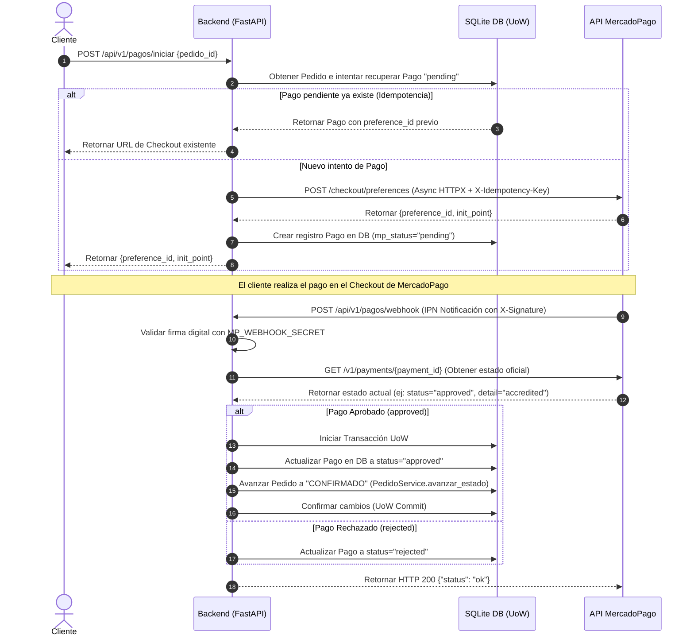

# Technical Design: Backend - Integración con MercadoPago (Idempotency y Webhook)

Este documento detalla el diseño de bajo nivel, la estructura de la base de datos, algoritmos de validación y flujos lógicos asíncronos para la integración con MercadoPago.

---

## 1. Diseño de Base de Datos (Relaciones)

```mermaid
erDiagram
    pedidos ||--o{ pagos : "tiene intentos de"
    pedidos {
        bigint id PK
        varchar estado_codigo FK
        decimal total
    }
    pagos {
        bigint id PK
        bigint pedido_id FK "ON DELETE CASCADE"
        bigint mp_payment_id UQ "NULL"
        varchar mp_status "pending | approved | rejected | cancelled"
        varchar mp_status_detail
        varchar external_reference UQ
        varchar idempotency_key UQ
        decimal transaction_amount
        varchar payment_method_id
        timestamp created_at
        timestamp updated_at
    }
```

---

## 2. Flujo Asíncrono de Negocio (Secuencia)



---

## 3. Algoritmo de Validación de Firma Digital (X-Signature)

Para verificar que las notificaciones del webhook provienen exclusivamente de MercadoPago, implementamos la verificación criptográfica del header `x-signature` que MercadoPago provee:

1. El header `x-signature` tiene el formato: `ts=timestamp,v1=signature`.
2. Se extrae `ts` (timestamp de la petición) y `v1` (la firma hash provista).
3. Se construye el string de firma (`manifest`): `id:${resource_id};ts:${ts}`.
4. Se calcula el HMAC-SHA256 del `manifest` utilizando la clave secreta `MP_WEBHOOK_SECRET`.
5. Se realiza una comparación en tiempo constante (`hmac.compare_digest`) entre el hash calculado y la firma `v1` extraída del header.
6. Si coinciden, el webhook es legítimo. De lo contrario, se rechaza inmediatamente con `401 Unauthorized` o `403 Forbidden`.

*Nota de Simplicidad para Entornos de Testeo*:
En entornos de desarrollo local o durante la ejecución de los tests TDD, si `MP_WEBHOOK_SECRET` no está configurado o es una suite mockeada, se permite bypassear la firma con un log de advertencia para agilizar la integración de pruebas unitarias.

---

## 4. Lógica de Simulación (Mocking) de MercadoPago en los Tests

Dado que no podemos invocar la API real de MercadoPago durante la ejecución de tests aislados, utilizaremos la capacidad nativa de `pytest` y la librería `pytest-mock` (o monkeypatch de FastAPI) para mockear el cliente `httpx.AsyncClient`.
- Para `iniciar_pago`: Simulamos la respuesta de MercadoPago con un JSON estructurado que contenga `id` (preference_id) y `init_point` (checkout URL).
- Para el `webhook`: Generamos un payload simulando la notificación de MercadoPago y mockeamos la consulta a `/v1/payments/{id}` para retornar el estado `approved` o `rejected` que deseamos validar.
