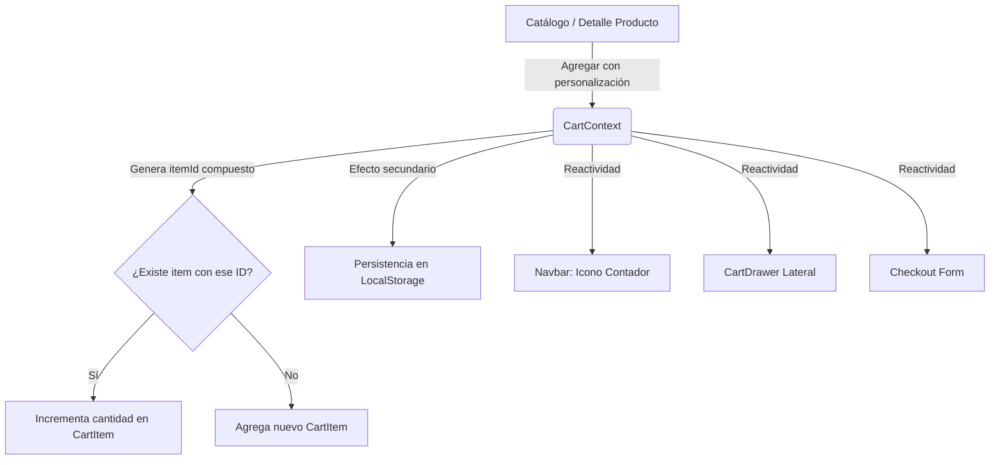

# Especificación de Diseño Técnico: Sistema de Carrito de Compras
Change ID: `030-frontend-store-carrito`
Estado: Draft

## 1. Arquitectura y Estructura de Datos

El carrito debe actuar como un módulo desacoplado dentro de `features/carrito`. Su estado se expondrá mediante un Contexto global de React (`CartContext`) y un hook fácil de consumir (`useCart`).

### 1.1 Estructura de Tipos (`types/carrito.types.ts`)
```typescript
import { ProductoReadDetalle } from "@/features/catalogo/types/catalogo.types";

export interface CartItem {
  // Generamos un hash de ítem único: id_producto + "_" + lista_ingredientes_excluidos.join("-")
  id: string; 
  producto: ProductoReadDetalle;
  cantidad: number;
  // Lista de IDs de ingredientes excluidos por el cliente
  personalizacion: number[]; 
}

export interface CartState {
  items: CartItem[];
  totalItems: number;
  totalPrecio: number;
}

export interface CartContextProps extends CartState {
  addItem: (producto: ProductoReadDetalle, cantidad: number, personalizacion: number[]) => void;
  removeItem: (itemId: string) => void;
  updateQuantity: (itemId: string, cantidad: number) => void;
  clearCart: () => void;
}
```

### 1.2 Algoritmo de Identificación Única (Evitar Agrupamiento Incorrecto)
Para poder tener múltiples líneas del **mismo producto** pero con **personalizaciones distintas** (ej. hamburguesa sin cebolla vs. hamburguesa sin tomate), no podemos usar simplemente el `producto.id` como clave del carrito.
Generamos un `id` compuesto para el ítem de carrito:
```typescript
const generateCartItemId = (productoId: number, personalizacion: number[]): string => {
  // Ordenamos la personalización de forma ascendente para evitar que el orden de desmarcado cambie el hash
  const sortedIds = [...personalizacion].sort((a, b) => a - b);
  return `${productoId}_${sortedIds.join("-")}`;
};
```

---

## 2. Flujo de Datos del Carrito



---

## 3. UI/UX: CartDrawer Premium (Diseño Estilizado)

### Características Visuales:
- **Glassmorphism:** Fondo oscuro semitransparente con `backdrop-blur-md` y bordes sutiles.
- **Transición Fluida:** Drawer lateral que se despliega desde la derecha con animación inercial de `motion`.
- **Efectos Micro-interactivos:**
  - Botones de incremento/decremento con hover suave y deshabilitado reactivo cuando llega a 1 unidad.
  - Indicador de stock dinámico: si el usuario intenta agregar más del stock disponible, se muestra un warning sutil "Máximo stock alcanzado".

### Acciones del Drawer:
1. **Visualizar ítems:** Lista escrolable con imágenes de productos, ingredientes excluidos (mostrados como etiquetas "Sin cebolla", "Sin tomate") y subtotal.
2. **Editar cantidad:** Incrementador numérico con control de límites.
3. **Eliminar:** Botón de tachito de basura rápido.
4. **Resumen de Compra:** Muestra cantidad total, total en pesos argentinos y botón premium "Iniciar Checkout" que redirige al flujo de compra.

---

## 4. Criterios de Validación Técnica
- **Aislamiento de la Lógica:** Cero lógica de negocio del carrito mezclada en componentes visuales. Todo vive en el hook `useCart`.
- **Validación de Tipos Estricta:** No se permite el uso de `any`.
- **Limpieza en el Desmontado:** El CartDrawer debe desmontarse fluidamente sin dejar artefactos visuales colgados en la pantalla.
