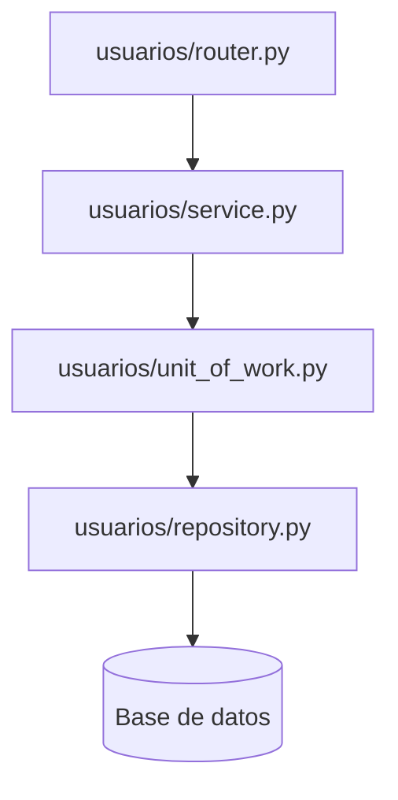

# Diseño Técnico: Mejoras en la Gestión de Usuarios (ABM Módulo Admin)

**ID del Cambio:** `033-mejoras-gestion-usuarios`  

---

## 1. Arquitectura de Backend

Seguiremos la arquitectura en capas estricta de **The Food Store**:
`Router` ➔ `Service` ➔ `Unit of Work` ➔ `Repository`



### 1.1. Esquemas de Pydantic (`usuarios/schemas.py`)

Añadiremos el esquema para la creación de usuarios administrativos:

```python
class UsuarioCreateRequest(SQLModel):
    nombre: str
    apellido: str
    email: str
    celular: Optional[str] = None
    password: str
    roles: list[str]
```

### 1.2. Cambios en el Repositorio (`usuarios/repository.py`)

Modificaremos la firma de `get_all_active_paginated` para soportar el parámetro opcional `rol`:

```python
def get_all_active_paginated(
    self, skip: int, limit: int, include_deleted: bool = False, rol: Optional[str] = None
) -> tuple[list[Usuario], int]:
    from sqlmodel import func
    from app.modules.auth.models import UsuarioRol
    
    query = select(Usuario)
    if rol:
        query = query.join(UsuarioRol).where(UsuarioRol.rol_codigo == rol)
    if not include_deleted:
        query = query.where(Usuario.deleted_at == None)  # noqa: E711
        
    total = self.session.exec(select(func.count()).select_from(query.subquery())).one()
    items = self.session.exec(query.offset(skip).limit(limit)).all()
    return items, total
```

### 1.3. Cambios en el Servicio (`usuarios/service.py`)

1. **`get_all`**: Recibirá el parámetro `rol` y lo enviará al repositorio.
2. **`crear_administrativo`**:
   - Recibe `UsuarioCreateRequest` y el ID del administrador que lo crea.
   - Verifica la unicidad del email.
   - Encripta la contraseña usando `get_password_hash`.
   - Añade el usuario a la base de datos usando la sesión del UoW.
   - Asigna los roles recibidos vinculándolos en `usuario_roles`.
   - Devuelve `UsuarioDetailResponse`.
3. **`restaurar`**:
   - Recibe el ID del usuario a restaurar.
   - Carga el registro (incluyendo aquellos con `deleted_at is not null`).
   - Limpia `deleted_at = None` y asegura `is_active = True`.
   - Confirma los cambios usando UoW.

### 1.4. Cambios en el Router (`usuarios/router.py`)

Añadiremos los dos nuevos endpoints:
- `POST /usuarios/` (crear usuario administrativo).
- `PATCH /usuarios/{id}/restore` (restaurar usuario eliminado).

Y actualizaremos `GET /usuarios/` para recibir el query parameter `rol` opcional.

---

## 2. Arquitectura de Frontend

### 2.1. Servicios de la API (`usersService.ts`)

Añadiremos y actualizaremos los siguientes llamados:
- `getUsuarios(skip, limit, includeDeleted, rol)`: Modificado para enviar parámetros como query string.
- `crearUsuario(data: UsuarioCreateRequest)`: Nueva función (`POST /usuarios/`).
- `eliminarUsuario(id: number)`: Nueva función (`DELETE /usuarios/${id}`).
- `restaurarUsuario(id: number)`: Nueva función (`PATCH /usuarios/${id}/restore`).

### 2.2. Modal premium de Alta de Usuario (`UsuarioCreateModal.tsx`)

Crearemos un componente en `/frontend/src/pages/usuarios/components/UsuarioCreateModal.tsx` con:
- Estilo premium: glassmorphism, backdrop-blur y un diseño flotante.
- Formulario de alta con validación de inputs (nombre, apellido, email, celular, password y selección de roles con checkboxes/select múltiple).
- Feedback visual de carga y manejo de errores.

### 2.3. Cambios en `UsuariosPage.tsx`

1. **Barra de Herramientas Premium:**
   - Botón **"+ Nuevo Usuario"** con animación e icono de Lucide (`UserPlus`).
   - Dropdown de selección para filtrar por rol (Todos, Administradores, Encargados, Clientes).
   - Toggle switch elegante para activar/desactivar "Ver Archivados".
2. **Visualización e Interacciones en la Tabla:**
   - Si un usuario tiene `deleted_at is not null`, se renderizará con una opacidad reducida, un badge indicador de "Eliminado" en lugar de "Activo/Suspendido", y un botón visual **"Restaurar"** (con icono de `RotateCcw`) en lugar de "Suspender/Activar".
   - Botón **"Eliminar"** (Soft Delete) representado con el icono de un tacho de basura (`Trash2`), que incluye una confirmación inline o mediante alert para evitar clics accidentales.
   - Manejo del selector de roles más flexible para asignar y actualizar múltiples roles en lugar de un switch binario básico.
