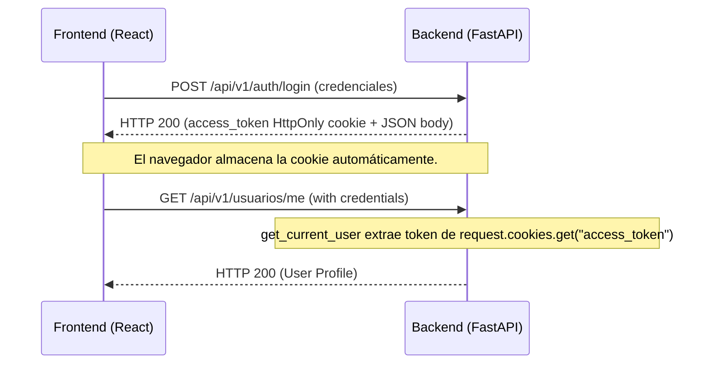

# Diseño Técnico: Robustecimiento de Seguridad mediante Cookies HttpOnly y Control de Accesos Multi-Rol (037)

Este documento detalla la arquitectura de seguridad y la implementación técnica para migrar de tokens Bearer en headers a cookies HttpOnly, proteger los endpoints del backend usando un modelo de control de accesos basado en roles (RBAC) y manejar la invalidación de sesión en el frontend.

## Arquitectura de Autenticación

Actualmente, el backend genera y devuelve un token en el login, y el middleware de FastAPI/CORS permite credenciales. Sin embargo, la dependencia `get_current_user` extrae el token del header `Authorization`. Cambiaremos esto para que sea un flujo estrictamente basado en la cookie `access_token`.



## Cambios Propuestos

### 1. Backend

#### [MODIFY] [dependencies.py](file:///c:/Users/Lauti/OneDrive/Escritorio/TI-Magni/backend/app/core/dependencies.py)
* Reemplazar la dependencia `OAuth2PasswordBearer` por el uso directo del objeto `Request` de FastAPI.
* Extraer el token usando `request.cookies.get("access_token")`.
* Si el token no está presente o no se valida correctamente con `decode_access_token`, lanzar `HTTPException(401, detail="No autenticado.")`.

```python
def get_current_user(request: Request) -> dict:
    token = request.cookies.get("access_token")
    if not token:
        raise HTTPException(
            status_code=status.HTTP_401_UNAUTHORIZED,
            detail="Token de autenticación faltante.",
            headers={"WWW-Authenticate": "Bearer"},
        )
    return decode_access_token(token)
```

#### [MODIFY] [router.py (Categorías)](file:///c:/Users/Lauti/OneDrive/Escritorio/TI-Magni/backend/app/modules/categorias/router.py)
* Proteger las rutas de lectura (`GET /` y `GET /{id}`) dejándolas abiertas al público general.
* Proteger las rutas de escritura (`POST /`, `PATCH /{id}`, `PATCH /{id}/toggle-active`, `DELETE /{id}`) y la de exportación (`GET /exportar`) requiriendo `Depends(require_role("ADMIN", "ENCARGADO", "STOCK"))`.

#### [MODIFY] [router.py (Productos)](file:///c:/Users/Lauti/OneDrive/Escritorio/TI-Magni/backend/app/modules/productos/router.py)
* Proteger las rutas de escritura de productos (`POST /productos/`, `PATCH /productos/{id}`, `DELETE /productos/{id}`, `POST /productos/{id}/ingredientes`) requiriendo `Depends(require_role("ADMIN", "ENCARGADO", "STOCK"))`.
* Proteger la disponibilidad del producto (`PATCH /productos/{id}/disponibilidad`) requiriendo `Depends(require_role("ADMIN", "ENCARGADO", "STOCK"))`.
* Proteger las unidades de medida de lectura (`GET /unidades-medida/`, `GET /unidades-medida/{id}`) dejándolas abiertas o para cualquier autenticado. Las de escritura (`POST /unidades-medida/`, `PATCH /unidades-medida/{id}`, `DELETE /unidades-medida/{id}`) requieren `Depends(require_role("ADMIN", "ENCARGADO"))`.
* Las rutas de consulta de catálogo de productos siguen abiertas al público general.

#### [MODIFY] [router.py (Ingredientes)](file:///c:/Users/Lauti/OneDrive/Escritorio/TI-Magni/backend/app/modules/ingredientes/router.py)
* Cambiar los endpoints de lectura (`GET /`, `GET /exportar`, `GET /{id}`) para requerir que el usuario sea personal de la tienda: `Depends(require_role("ADMIN", "ENCARGADO", "STOCK", "PEDIDOS", "CAJERO", "COCINERO"))`.
* Cambiar los endpoints de escritura (`POST /`, `PATCH /{id}`, `PATCH /{id}/toggle-active`, `DELETE /{id}`) para requerir `Depends(require_role("ADMIN", "ENCARGADO", "STOCK"))`.

#### [MODIFY] [router.py (Usuarios)](file:///c:/Users/Lauti/OneDrive/Escritorio/TI-Magni/backend/app/modules/usuarios/router.py)
* Mantener `GET /me` y `PATCH /me` protegidos únicamente con `Depends(get_current_user)`.
* Proteger el resto de los endpoints administrativos (`GET /`, `GET /exportar`, `POST /`, `PATCH /{id}/toggle-active`, `PATCH /{id}/roles`, `DELETE /{id}`, `PATCH /{id}/restore`) requiriendo `Depends(require_role("ADMIN"))`.

---

### 2. Frontend

#### [MODIFY] [apiClient.ts](file:///c:/Users/Lauti/OneDrive/Escritorio/TI-Magni/frontend/src/shared/api/apiClient.ts)
* Agregar `credentials: "include"` por defecto en la llamada `fetch` dentro de `fetchApi`.
* Modificar el interceptor de errores: si `response.status === 401 || response.status === 403`, invocar `handleTokenExpired()` (que destruye el local storage) y lanzar la redirección correspondiente al `/login`.

#### [MODIFY] [categoriasService.ts](file:///c:/Users/Lauti/OneDrive/Escritorio/TI-Magni/frontend/src/features/categorias/services/categoriasService.ts)
* En `exportarCategorias()`, agregar `credentials: "include"` a la función `fetch` manual.

#### [MODIFY] [insumosService.ts](file:///c:/Users/Lauti/OneDrive/Escritorio/TI-Magni/frontend/src/features/insumos/services/insumosService.ts)
* En `exportarIngredientes()`, agregar `credentials: "include"` al `fetch` manual.

#### [MODIFY] [usersService.ts](file:///c:/Users/Lauti/OneDrive/Escritorio/TI-Magni/frontend/src/features/users/services/usersService.ts)
* En `exportarUsuarios()`, agregar `credentials: "include"` al `fetch` manual.

---

### 3. Tests

#### [MODIFY] [test_usuarios.py](file:///c:/Users/Lauti/OneDrive/Escritorio/TI-Magni/backend/tests/test_usuarios.py) y otros archivos de test
* Configurar el cliente de test (`TestClient`) para simular la cookie `access_token` en lugar de enviar el header `Authorization`.
* Esto se logra inyectando la cookie usando `client.cookies.set("access_token", token)` o pasando `cookies={"access_token": token}` en cada solicitud de prueba.
